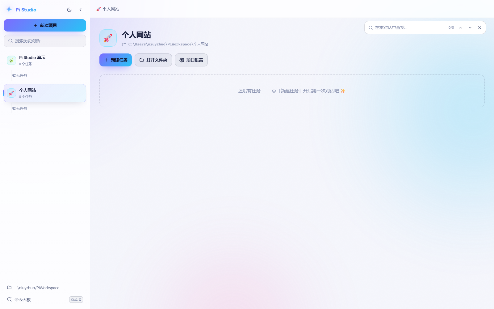
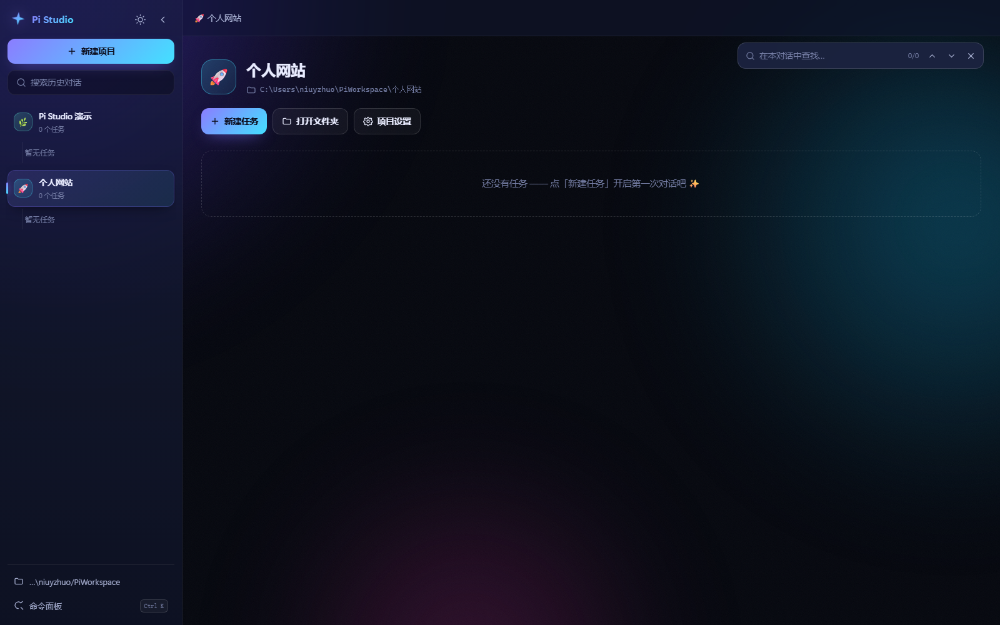

<div align="center">


# Pi Studio

**给 [pi](https://www.npmjs.com/package/@earendil-works/pi-coding-agent) 编码助手做的本地网页界面。**
不用开终端，双击图标就能用。

[**在线演示**](https://niuyizh.github.io/pi-studio/) · [开始使用](#使用)



</div>

---

## 功能

- **项目分文件夹**：每个项目对应磁盘上一个目录，任务（会话）挂在项目下。历史会话从 pi 的 sessions 目录读取，随时接着聊。
- **完整的对话体验**：流式输出、思考过程可折叠、工具调用是卡片（点开看输入和输出）、Markdown 支持表格与代码块复制。
- **搜索**：`Ctrl+Shift+F` 搜所有历史对话，问题和回答都能搜到，点结果直接定位到那条消息；`Ctrl+F` 在当前对话里查找。
- **外观**：6 套配色 × 浅色 / 深色，侧栏宽度可拖动，选择会被记住。
- **难度与花销**：思考深度按当前模型支持的范围切换，顶栏实时显示 token 总量和预估费用。
- 图片粘贴发送、命令面板、`/` 唤起命令与技能。

<div align="center">

| 深色 | 浅绿 |
| --- | --- |
|  |  |

</div>

## 环境要求

Node.js 18+，以及全局安装的 pi：

```bash
npm i -g @earendil-works/pi-coding-agent
```

## 使用

```bash
git clone https://github.com/niuyizh/pi-studio.git
cd pi-studio
node server.mjs
```

浏览器会自动打开 <http://127.0.0.1:4317/>。端口被占用时会往后找（4317–4336）。

Windows 下可以双击 `start-hidden.vbs` 在后台启动，右键发到桌面当快捷方式用起来更顺手（图标用仓库里的 `icon.ico`）。`start-debug.bat` 是前台运行、能看日志的版本，`stop.bat` 用来停止服务。

## 快捷键

| 按键 | 作用 |
| --- | --- |
| `Enter` / `Shift + Enter` | 发送 / 换行 |
| `Ctrl + K` | 命令面板 |
| `Ctrl + Shift + F` | 搜索所有历史对话 |
| `Ctrl + F` | 在当前对话中查找 |
| `Ctrl + B` | 收起侧边栏 |
| `Ctrl + N` | 新建任务 |
| `Ctrl + Shift + L` | 切换浅色 / 深色 |
| `/` | 弹出命令与技能列表 |
| `Esc` | 停止生成 / 关闭弹窗 |

生成过程中按 `Enter`，消息会排队，等当前回合结束再发给模型。

## 数据位置

| 内容 | 位置 |
| --- | --- |
| 项目 / 任务元数据、日志 | 仓库目录下的 `data/` |
| 项目工作目录 | `~/PiWorkspace/<项目名>/`，新建项目时默认在这里，也可以选已有目录 |
| pi 的会话文件 | `~/.pi/agent/sessions/`，由 pi 自己管理 |

## 在线演示

<https://niuyizh.github.io/pi-studio/> 是一份静态演示：界面是完整的，数据是预置的，不会调用模型。

`docs/` 既是前端目录也是 Pages 站点根目录，发布时在 **Settings → Pages** 选 `main` 分支 + `/docs` 文件夹即可，不需要构建步骤。

## 常见问题

**找不到 pi CLI**
确认已经执行 `npm i -g @earendil-works/pi-coding-agent`。如果 node 装在非标准位置，可以在仓库目录建一个 `node-path.txt`，里面写 node.exe 的完整路径。

**启动后没反应**
跑一次 `start-debug.bat` 看输出，或者查看 `data/server.log`（服务日志）和 `data/launcher.log`（启动脚本捕获的输出）。

**提示 `403 / Key limit exceeded`**
这是模型服务商的额度问题，与界面无关。点顶栏的模型名换一个即可。

**想卸载**
删掉仓库目录和快捷方式。`~/.pi` 下的会话记录不受影响。

## 实现

服务端零依赖，只用 Node 内置模块；前端是原生 HTML/CSS/JS，没有构建步骤，改完刷新浏览器即可。

通过 `pi --mode rpc` 子进程通信（JSONL over stdio），事件用 SSE 推送到浏览器；不活跃的 pi 进程按 LRU 回收，避免内存堆积。会话列表和全文搜索直接读 `sessions/*.jsonl`，没有额外的数据库。

```
server.mjs          服务：静态资源 + JSON API + SSE + 子进程管理
docs/               前端，同时是 GitHub Pages 的站点根目录
  index.html
  style.css
  app.js
  demo.js           演示模式：拦截 /api/* 与 EventSource，回放预置数据
  assets/           截图与 logo
icon.ico
start-hidden.vbs    Windows 后台启动
start-debug.bat     Windows 前台启动
stop.ps1 / stop.bat
data/               运行时生成
```

## License

[MIT](LICENSE)
