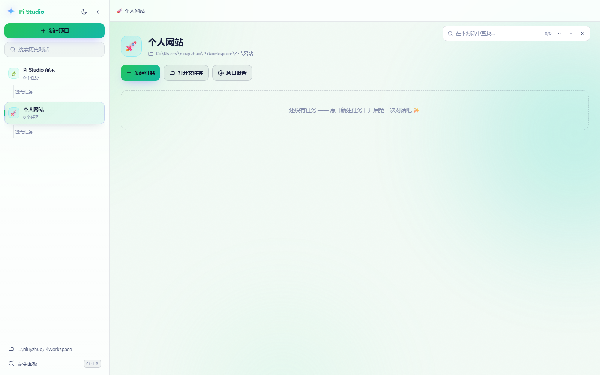

<div align="center">


# Pi Studio

**给 [pi](https://www.npmjs.com/package/@earendil-works/pi-coding-agent) 编码助手做的本地网页界面** —— 不用再开终端，双击桌面图标就能用。

<sub>A local web UI for the [pi](https://www.npmjs.com/package/@earendil-works/pi-coding-agent) coding agent — no terminal needed. Light/dark, 6 color themes, per-project folders, cross-session full-text search, live token cost.</sub>

浅色 / 深色 · 6 套配色 · 项目分文件夹 · 跨会话全文搜索 · 难度与 token 花销可见


<sub>浅色主题 · 紫青配色</sub>

</div>

---

## 特性

| | |
| --- | --- |
| 🎨 **6 套配色 × 浅色/深色** | 紫青 / 浅绿 / 浅黄 / 樱花粉 / 天蓝 / 薰衣草，选择会被记住 |
| 📁 **按项目分文件夹** | 每个项目对应磁盘上一个独立文件夹，任务（会话）都归在项目下 |
| 🔍 **两处搜索** | 跨所有历史对话搜（找以前问过的问题）＋ 当前对话内查找定位 |
| ↔️ **侧栏可拖动调宽** | 拖右边缘调整，双击复位，宽度会被记住 |
| 🧠 **难度可调** | 随时切换思考深度，档位按当前模型实际支持的范围自动收敛 |
| 💰 **花销可见** | 顶栏实时显示 token 总量与预估花费，点开看输入/输出/缓存明细 |
| ⚡ **流式体验** | 打字机输出、可折叠的思考过程、工具调用卡片（点击展开输入/输出） |
| 🖼️ **图片直发** | 粘贴或拖拽图片直接作为附件发给模型 |
| 🧩 **就是 pi 本身** | 复用你已有的 `~/.pi` 配置、模型、扩展、技能和会话历史，零额外配置 |

<div align="center">

| 深色 | 浅绿 |
| --- | --- |
|  |  |

</div>

## 前置要求

1. **Node.js ≥ 18**（推荐 20+）
2. **pi 已全局安装**：

   ```bash
   npm i -g @earendil-works/pi-coding-agent
   ```

   Pi Studio 不重复造轮子，它就是调用你机器上的 `pi --mode rpc`。

## 快速开始

```bash
git clone https://github.com/<你的用户名>/pi-studio.git
cd pi-studio
```

然后：

- **Windows**：双击 `start-hidden.vbs`（后台静默启动 + 自动开浏览器）
- **任意平台**：`node server.mjs`（前台运行，能看到日志）

浏览器会自动打开 <http://127.0.0.1:4317/>。端口被占用时会自动往后找（4317–4336）。

### Windows 快捷方式

想做成桌面图标，右键 `start-hidden.vbs` → 发送到 → 桌面快捷方式即可，图标可以选仓库里的 `icon.ico`。

如果启动失败，会弹窗显示日志末尾；也可以看：

- `data/server.log` —— 服务自己的日志
- `data/launcher.log` —— 启动脚本捕获的输出
- 或直接跑 `start-debug.bat` 看完整输出

### 停止服务

- Windows：双击 `stop.bat`
- 任意平台：前台运行时按 `Ctrl+C`，或结束对应 node 进程

## 概念：项目与文件夹

```
%USERPROFILE%\PiWorkspace\<项目名>\     ← 项目的工作目录（每个项目一个文件夹）
%USERPROFILE%\.pi\agent\sessions\      ← pi 的会话文件，Pi Studio 直接读写
<仓库目录>\data\                        ← Pi Studio 自己的配置与日志
    studio.json   项目 / 任务的元数据、外观设置
    server.log    服务日志
```

- 新建项目时默认在工作区根目录下创建同名文件夹，也可以「浏览」选择任意已有目录（比如你现有的工程目录）。
- 项目里的「任务」就是一次独立的 pi 会话；对话历史从磁盘恢复，随时点回来继续。
- 换电脑或换 pi 版本都不影响 —— 数据都在上面这几个熟悉的位置。

## 快捷键

| 按键 | 作用 |
| --- | --- |
| `Enter` | 发送 |
| `Shift + Enter` | 换行 |
| `Ctrl + K` | 命令面板（搜项目 / 任务 / 操作） |
| `Ctrl + Shift + F` | **搜索所有历史对话** |
| `Ctrl + F` | **在当前对话中查找**（`Enter` 下一个 / `Shift+Enter` 上一个） |
| `Ctrl + B` | 收起 / 展开侧边栏 |
| `Ctrl + N` | 当前项目下新建任务 |
| `Ctrl + Shift + L` | 快速切换浅色 / 深色 |
| `Esc` | 停止生成 / 关闭弹窗 / 关闭查找栏 |
| `/` | 在输入框输入斜杠，弹出命令与技能列表 |
| 粘贴 / 拖拽图片 | 直接作为附件发给模型 |

生成过程中再按 `Enter`，消息会进入队列（steering），在当前回合结束后送进模型。

## 搜索

**跨对话搜索** —— 找「以前问过的那个问题」

- 点左栏「搜索历史对话」，或按 `Ctrl+Shift+F`
- 直接扫描 `~/.pi/agent/sessions/` 下所有会话文件，问题和回答都能搜到，支持中文
- 结果按会话分组、带高亮片段，可切换「全部 / 我问过的 / 助手的回答」
- 点一条结果 → 自动打开对应项目与任务，并**定位并闪烁标记到那条消息**

**对话内查找**

- 按 `Ctrl+F` 弹出查找栏，输入即高亮所有命中，`Enter` / `Shift+Enter` 跳转

## 外观

点侧栏顶部的 ☀️ / 🌙 按钮打开外观面板：

- **明暗**：浅色（默认）/ 深色
- **配色**：紫青 / 浅绿 / 浅黄 / 樱花粉 / 天蓝 / 薰衣草

配色不只换强调色 —— 页面底色、渐变、光晕背景、用户气泡、引用块都会一起协调变化。

也可以用 URL 参数临时指定（方便截图或分享固定外观）：

```
http://127.0.0.1:4317/?theme=dark&accent=mint
```

## 常见问题

**找不到 pi CLI？**

```bash
npm i -g @earendil-works/pi-coding-agent
```

也可以在 `server.mjs` 里改 `findPiCli()` 的查找路径。

**端口被占用？**

服务会自动尝试 4317–4336。也可以手动指定：

```bash
node server.mjs --port 4400
```

**启动隐藏窗口版没有反应？**

跑一次 `start-debug.bat`，或者看 `data/launcher.log`。

**模型报 `403 Key limit exceeded`？**

那是模型服务商的额度问题，与界面无关。点顶栏的模型名换一个即可。

**想彻底卸载？**

删掉这个仓库目录，以及桌面/开始菜单的快捷方式即可。pi 的会话文件在 `~/.pi/agent/sessions`，不受影响。

## 技术说明

零依赖、零构建：服务端只用 Node 内置模块，前端是原生 HTML/CSS/JS，改完刷新浏览器即可。

```
pi-studio/
├─ server.mjs          # HTTP + SSE 服务、JSON API、pi RPC 子进程管理
├─ public/
│  ├─ index.html
│  ├─ style.css        # 全部样式（含 6 套配色的 CSS 变量）
│  └─ app.js           # 渲染、Markdown、SSE、搜索、查找等全部前端逻辑
├─ docs/               # README 里的截图和 logo
├─ icon.ico
├─ start-hidden.vbs    # Windows 后台静默启动
├─ start-debug.bat     # Windows 前台启动（看日志）
├─ stop.ps1 / stop.bat # 停止服务
└─ data/               # 运行时生成（已被 gitignore）
```

工作方式：

1. 服务端用 `child_process` 拉起 `pi --mode rpc`（`cwd` = 项目文件夹），通过 stdin/stdout 收发 JSONL。
2. 把 pi 的事件流用 **SSE** 推给浏览器；同时按 LRU 回收不活跃的 pi 进程，避免内存堆积。
3. 会话列表、全文搜索直接读 `~/.pi/agent/sessions/**/*.jsonl`，不另建数据库。

调试小工具：`?nostream` 或 `?shot=dark.mint` 会跳过 SSE 长连接（方便做页面快照）。

## License

[MIT](LICENSE)
